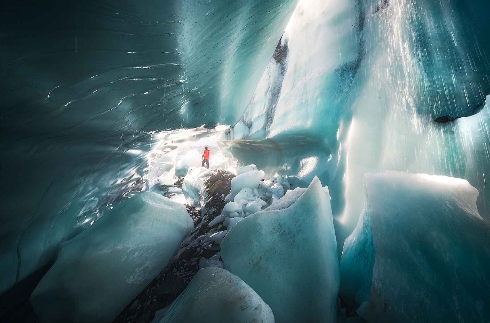

这篇博客是个人学习教程《风光摄影后期基础》的学习笔记，其中有很多直接对于原书直接的摘录和引用，再加上了自己的一些总结和感悟

> "风光摄影，是以展现自然风光之美为主要创作题材的原创作品（如自然景色、城市建筑摄影等） ，是多元摄影中的一个门类。从摄影术诞生那天起，风光摄影就独占鳌头。人类第一张永久性摄影作品就是风光（1826年，法国人尼埃普斯拍摄了他自家窗外的景物《窗外景色》）"——百度百科

风光摄影现在主要分为**流行风光摄影、自然风光摄影和艺术风光摄影**。其中**流行风光摄影**，兼顾职业和爱好，综合想法、前期拍摄和后期处理，是最热门的一个领域；流行风光摄影重在风光美的展现，以及情绪、气氛的渲染，后期处理的尺度较宽。流行风光摄影也有比较大的群众基础，国内的图虫网（tuchong.com）、500px.me，以及国外的Instagram、500px.com和1x.com都是大众流行领域、优秀风光摄影师和优秀作品云集的地方。

**自然风光摄影**则更强调前期拍摄的探索和发现，后期处理的尺度较窄。自然风光摄影的领军者，毫无疑问是《国家地理》杂志及其网站，上面的作品有鲜为人知的无人区景色、惊险刺激的户外探险记录，以及罕见的自然天相和景观。天文摄影随着技术的普及和大众意识的提高，是自然风光摄影领域中发展最快的一个分支。

而**艺术风光摄影**，则更多地是探索一些创新的表达方式，以及记录、反思和展现人类发展、环境变迁、自然进化的相关主题。这些严肃的话题就是这些爱好者们很少系统性涉及的地方了。

# 后期重要的是什么？

学习摄影，要多思考，要跳出器材、工具、技术层面的羁绊，从更高的角度，跳出框架去思考。决定一张照片的好坏，并不是使用了什么技术，用了什么器材，而是照片**最后的美感以及内容的呈现**。

在照片中应用构图法则、色彩搭配和视觉引导，不仅是为了**应用技术从基本框架与原理上让照片更好看**，更是为了**突出主题和主体，强化情感气氛并传达场景故事**。所以我们说：

> 器材服务于技术，技术服务于形式，形式服务于内容。也即内容决定形式，形式决定技术

后期处理时非常强调**美学上的最终效果、层次的分离、立体感的打造，以及光线的渲染**，这些才是真正让一张照片光彩照人的关键，以何种技术去得到这样的效果，只是难易之分，反而是次要的

最后引用泰罗的一句话阐述，摄影后期的三个层次就是，**简单矫正，还原眼睛之所见；局部修饰，还原脑海之所现；艺术加工，还原心中之所想**。心有所想，用术还原

